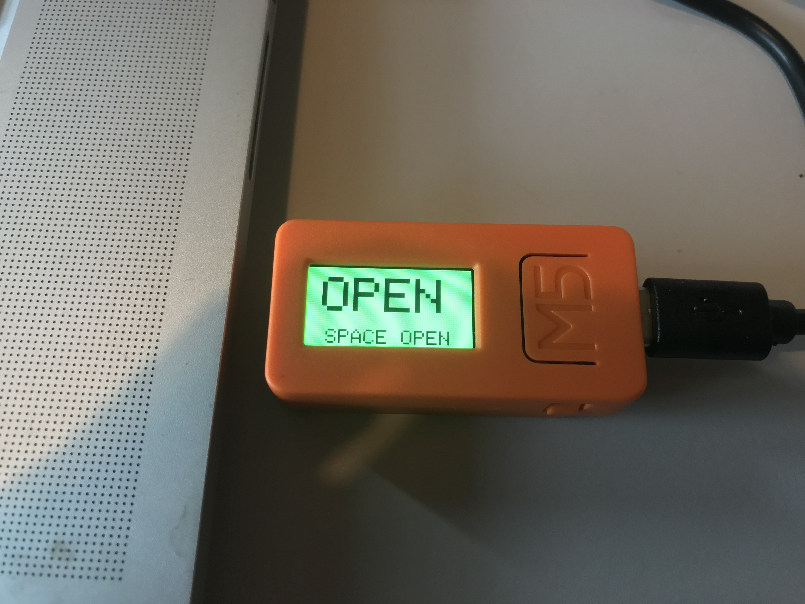

# M5StickC MQTT button
 Open / Close workplace with MQTT message

At [hackerspace TkkrLab](https://tkkrlab.nl) we use MQTT for all our domotica appliences such as status if we are open or closed. We already had this automated for our main/social room. We would also like to have the same function in our workplace.

I used a [M5StickC](https://s.click.aliexpress.com/e/_dUw3fXr) as button and display. On the display you can see if the workspace and main room is open / closed.

If you want to use this code, copy the 'config_sample.h' to 'config.h' and change the value acording to your situation.
